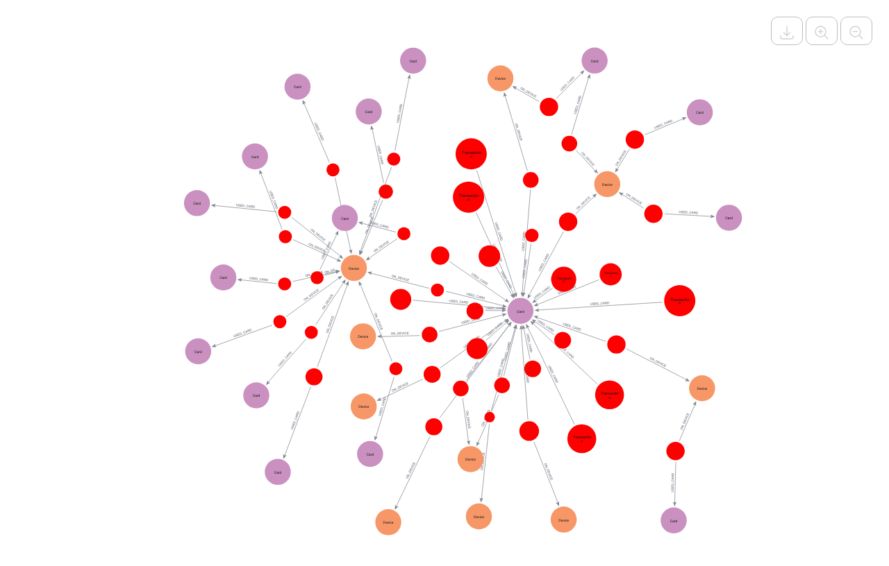
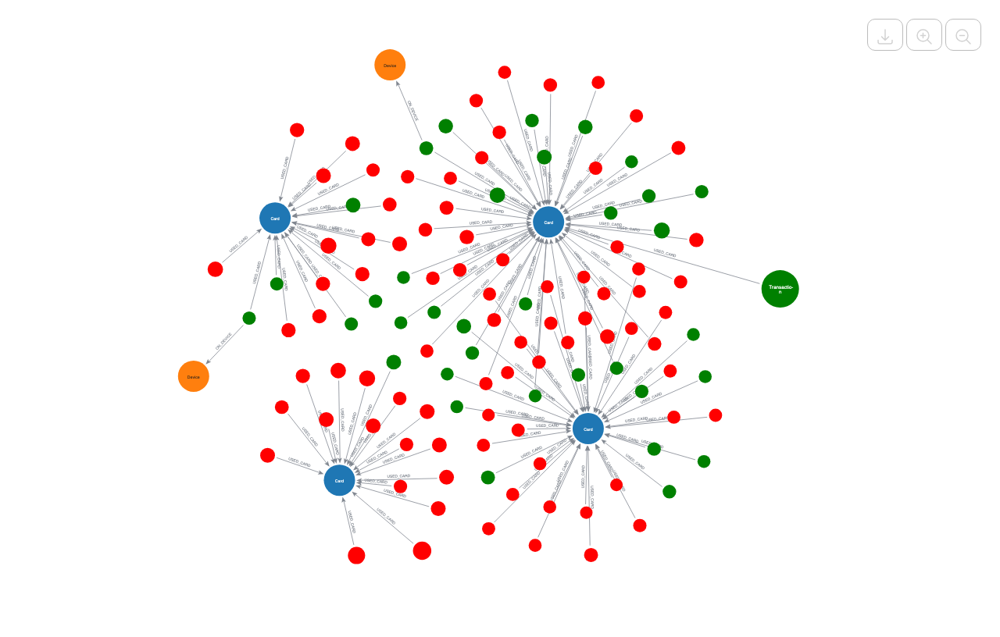
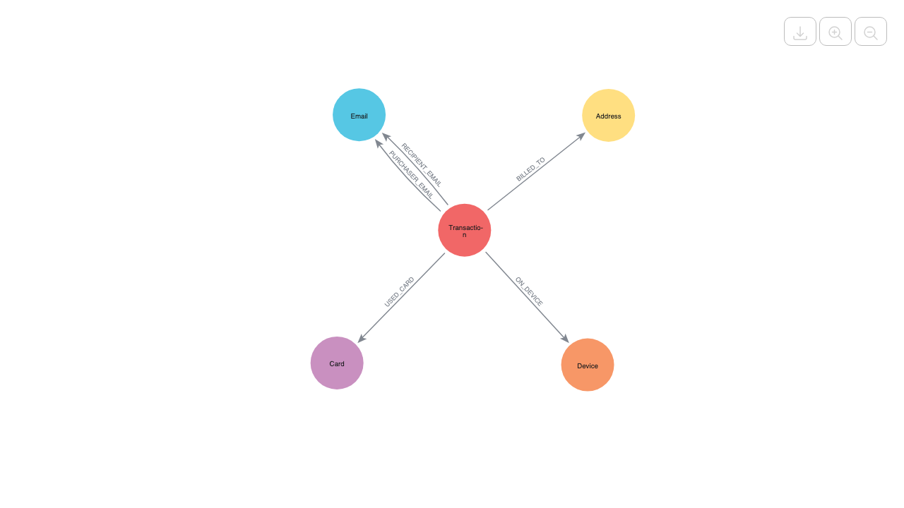
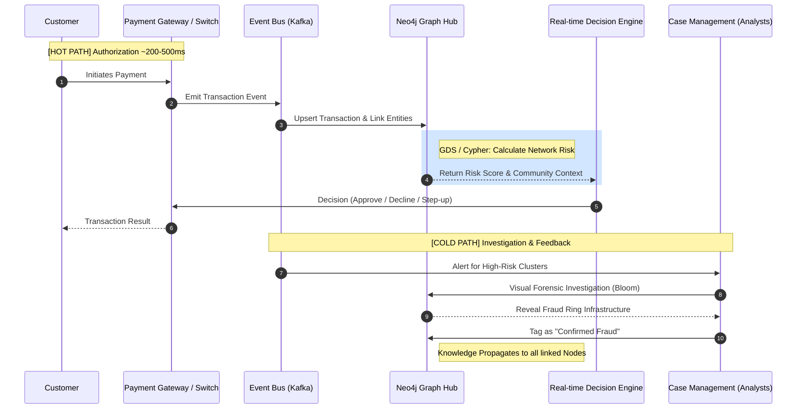
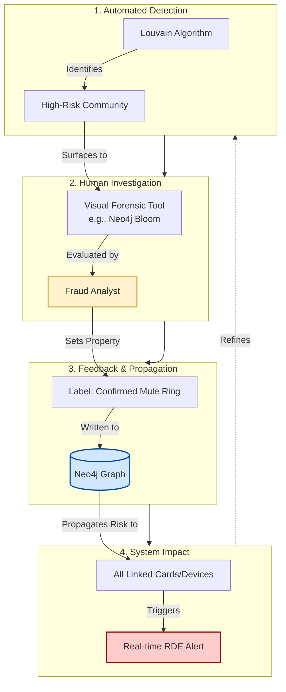

# Financial Fraud Topologies using Graphs & Neo4j

<p align="center">
  
  <br>
  <sub>A complex fraud ring showing interconnected fraudulent transactions, cards, and devices.</sub>
</p>


This repository demonstrates how to create a **Financial Fraud Detection** graph in Neo4j using the [IEEE-CIS Fraud Detection dataset](https://www.kaggle.com/c/ieee-fraud-detection). 

By combining transaction details with identity information, the graph helps organizations move beyond simple rule-based systems to detect complex patterns like **fraud rings**, **synthetic identities**, and **layered money laundering** schemes.

This is a classic use case for financial institutions looking to evolve from reactive "individual transaction analysis" to a proactive, network-based fraud management strategy.

<p align="center">
  
  <br>
  <sub>Tightly connected groups of fraudulent activity, known as "Fraud Islands."</sub>
</p>

This example includes three main notebooks:

1. **[Data Ingestion](loader.ipynb):** Loading the IEEE-CIS dataset (Transactions and Identity) into Neo4j, creating nodes for Transactions, Cards, Devices, Emails, and Addresses.
2. **[Specific Use Cases](analysis.ipynb):** Demonstrating key fraud detection queries and algorithms, including:
   - **Exploratory Data Analysis (EDA):** Understanding the distribution of fraud across devices and identifiers.
   - **Pattern Matching:** Identifying suspicious connectivity, such as devices shared by multiple distinct credit cards.
   - **Community Detection:** Using Graph Data Science (GDS) algorithms like Louvain to find "Fraud Islands" - tightly connected groups of fraudulent activity.
   - **Visualizing Fraud:** Rendering the subgraphs of fraud rings for investigation.
3. **[Model Training & Evaluation](train_evaluate.ipynb):** A working prediction model, combining traditional tabular data with graph features to train a machine learning model for fraud detection.

### What is Graph-Based Fraud Detection and Why Does It Matter?

Modern financial systems process millions of transactions daily. It is practically impossible for analysts to review every flag manually, and traditional tabular models often miss the "forest for the trees."

**Graph-Based Fraud Detection** is a strategic approach designed to solve the problem of "hidden links." Instead of treating every transaction as an isolated event, it uses real-world context to determine if a transaction is part of a larger fraudulent network. Graph features calculated within Neo4j can also be used as inputs to well established machine learning models in use by financial institutions, improving their accuracy.

It shifts the focus from "Is this transaction weird?" to "Who is this entity connected to?" by considering factors like:

* **Shared Resources:** Are 50 different user accounts logging in from the same Device ID?
* **Indirect Connections:** Did this account send money to an account that shares an email with a known fraudster?
* **Velocity:** How quickly is this community of accounts forming and transacting?

By connecting these dots, graph analysis helps organizations stop chasing false positives and focus their limited resources on the organized crime rings that cause the most damage.

### Data Sources

In this example, we integrate two primary tables from the IEEE-CIS dataset to build a holistic view:

1. **Transaction Data:** Core payment details including transaction amount, product code, and card information (Card Type, Issuer). This forms the backbone of the graph (`(:Transaction)-[:USED_CARD]->(:Card)`).
2. **Identity Data:** Technical signals collected during the transaction, such as **Device ID, IP Address, Screen Resolution, and Operating System**. These properties are crucial for linking seemingly unrelated transactions (`(:Transaction)-[:ON_DEVICE]->(:Device)`).

### The Graph Advantage

<p align="center">
  
  <br>
  <sub>The path of fraudulent transactions through mule cards and devices.</sub>
</p>

Traditional fraud management relies on flat lists and rules (e.g., "Amount > $10,000"), which often lead to high false positive rates because they treat a legitimate big spender the same as a thief.

By using Neo4j, we can perform **Link Analysis** to answer critical questions:

* **Reachability:** Is this fresh credit card actually linked to a device previously used for fraud?
* **Impact:** If this account is compromised, how many other accounts share its recovery email?
* **Efficiency:** Which "Supernodes" (e.g., a specific device) are hubs for 90% of our fraudulent activity?

### The Resulting Schema

With the data loaded, our graph schema looks like the following:

<p align="center">
  
  <br>
  <sub>High-level overview of the Fraud Detection Graph Schema.</sub>
</p>

We include nodes for **Transactions**, **Cards**, **Devices**, **Emails**, and **Addresses**. The relationships capture the action of a transaction utilizing these resources.

#### The Schema

This Neo4j schema models the relationships between financial events (Transactions) and the entities that facilitate them.

Node labels and relationships (as created in `loader.ipynb`):
- **Transaction:** The central event.
- **Card:** Represents the payment instrument (Credit/Debit).
- **Device:** The physical or digital device fingerprint.
- **Email:** Purchaser (`P_emaildomain`) and Recipient (`R_emaildomain`) domains.
- **Address:** Billing locations (Zip code).

Schema outline in Cypher:

```cypher
// Transactions using Cards
(:Transaction)-[:USED_CARD]->(:Card)

// Transactions associated with Devices
(:Transaction)-[:ON_DEVICE]->(:Device)

// Transactions linked to Contact Info
(:Transaction)-[:PURCHASER_EMAIL]->(:Email)
(:Transaction)-[:RECIPIENT_EMAIL]->(:Email)
(:Transaction)-[:BILLED_TO]->(:Address)
```

### The Machine Learning Angle

In **[train_evaluate.ipynb](train_evaluate.ipynb)**, we demonstrate how to supercharge specific machine learning models by feeding them graph-based features.

While traditional fraud models rely on discrete rows of data (e.g., "Transaction Amount" or "Time of Day"), they often miss the rich context of relationships. By using Neo4j as a feature store, we calculate topological metrics for every node and use them to train an **[XGBoost](https://xgboost.readthedocs.io/en/stable/)** classifier.

**Graph Features Generated in Neo4j (via GDS):**

- **PageRank:** Measures the relative importance or "influence" of a node (e.g., a device used by many high-value cards).
- **Degree Centrality:** Counts the number of direct connections. High degree often signals suspicious high-velocity activity.
- **Community Size (WCC):** Derived from Weakly Connected Components. This identifies the size of the isolated group a transaction belongs to. "Fraud Rings" often appear as disjoint communities of moderate size, distinct from the giant component of legitimate users.

**Data Pipeline:**

- **Feature Engineering:** Execute GDS algorithms (PageRank, WCC, Degree) and write scores back to the graph.
- **Extraction:** Query Neo4j to build a training set merging Tabular Features (Time, Amount) + Graph Features.
- **Training:** Train an [XGBoost](https://xgboost.readthedocs.io/en/stable/) Classifier.
- **Evaluation:** Validation using ROC-AUC and Precision-Recall Area Under Curve (PR-AUC).

This "Graph-Enhanced" approach enables the model to learn sophisticated patterns, such as "A high-amount transaction from a device that is central to a community of 50 other nodes," rather than just "A high-amount transaction."

## Extended Architecture: Enterprise Banking Integration

### Placement in the Banking Ecosystem

In a modern banking stack, the Fraud Knowledge Graph extends the Core Banking System; it acts as an **Intelligence Layer** that sits between or alongside transaction processing and risk operations.

* **Upstream:** Core Banking Systems, Payment Gateways (ISO 20022 messages), and Digital Channel Telemetry (Mobile/Web logs).
* **The Hub (The Graph):** Consolidates silos (KYC, Auth logs, Transaction history) into a unified entity-link model.
* **Downstream:** Case Management Systems (for manual review) and Real-time Decision Engines (for automated block/allow).

```mermaid
graph LR
    subgraph Upstream [Data Sources & Ingestion]
        CBS[Core Banking Systems]
        PGW[Payment Gateways<br/>ISO 20022]
        TEL[Digital Telemetry<br/>Mobile/Web Logs]
    end

    subgraph Hub [Fraud Knowledge Graph]
        direction TB
        G[Entity-Link Model]
        
        subgraph Silos [Unified Context]
            KYC[KYC Data]
            AUTH[Auth Logs]
            TX[Transaction History]
        end
        
        Silos --> G
    end

    subgraph Downstream [Decision & Operations]
        CMS[Case Management<br/>Manual Review]
        RDE[Real-time Decision Engine<br/>Auto Block/Allow]
    end

    %% Connections
    Upstream --> Hub
    G --> Downstream

    %% Styling
    style Hub fill:#f9f9f9,stroke:#333,stroke-width:2px
    style G fill:#d1e7ff,stroke:#004a99,stroke-width:2px
    style RDE fill:#ffcccc,stroke:#990000
    style CMS fill:#fff2cc,stroke:#d6b656
```



### Integration Processes

#### Real-Time Streaming (Hot Path)

For immediate fraud prevention (e.g., blocking a wire transfer), the system integrates via a **Message Bus (Kafka/RabbitMQ/etc.)**:

1. A transaction is initiated at the Payment Switch.
2. A "Shadow Copy" of the transaction event is pushed to Kafka.
3. A **Graph Sink Connector** ingests the event into Neo4j, updating the "Device-to-Card" relationships in milliseconds.
4. The Graph calculates a "Network Risk Score" (e.g., *Is this card linked to a known fraudulent IP through 3 hops?*).
5. This score is fed back to the Authorization Engine to approve or decline the transaction.

#### Batch Enrichment (Cold Path)

Historical data from **Data Lakes (Snowflake/Hadoop/etc.)** is synchronized nightly:

* **Identity Resolution:** Merging customer profiles across different products (Checking, Credit, Mortgage) to find "First Party Fraud" or "Synthetic Identities."
* **Backfilling:** Updating the graph with newly confirmed fraud labels from the "Chargeback" department to re-calculate community risk scores.

#### Sequencing

The following diagram illustrates the data flow and integration points:



### Cross-Functional Data Ingestion

To be effective in a financial setting, the graph must ingest data from multiple "silos" that are typically disconnected:

| Data Source | Entity in Graph | Fraud Signal |
| --- | --- | --- |
| **KYC / Onboarding** | `Customer`, `Address`, `SSN` | Anonymized identities sharing a single physical address. |
| **Digital Channels** | `Device`, `IP`, `UserAgent` | Account Takeover (ATO) signals (one device hitting 50 accounts). |
| **Payment Switch** | `Transaction`, `Merchant`, `Terminal` | "Money Mule" patterns or merchant-side collusion. |
| **Watchlists** | `OFAC`, `PEP`, `Blacklist` | Direct links to sanctioned entities or high-risk regions. |

### Closed Feedback Loop

One of the most critical integration points is the **Analyst-to-Graph feedback loop**:

1. **Detection:** The Graph identifies a high-risk cluster using the **Louvain Community Detection** algorithm.
2. **Investigation:** An analyst reviews the cluster in a visual forensic tool (e.g., Neo4j Bloom).
3. **Labeling:** The analyst marks the cluster as "Confirmed Mule Ring."
4. **Propagation:** This label is written back to the Graph. Every node connected to that ring now inherits a "High Risk" property, which immediately alerts the system the next time any of those devices or cards are used.



### Compliance and Data Governance

In a banking environment (highly regulated), the architecture should account for:

* **PII Masking:** Using, for example, one-way hashes (MD5/SHA256) for Card Numbers (PANs) and SSNs as well as other PII data before they enter the graph. Pseudonymization ensures compliance with data protection regulations.
* **Right to Erasure (GDPR):** Automated scripts to prune customer nodes and their relationships upon request.
* **Explainability:** Storing the "Path of Reason" (e.g., *Why was this flagged?*) as a property on the transaction so that the bank can provide a clear reason for declining a payment if challenged by the customer.
